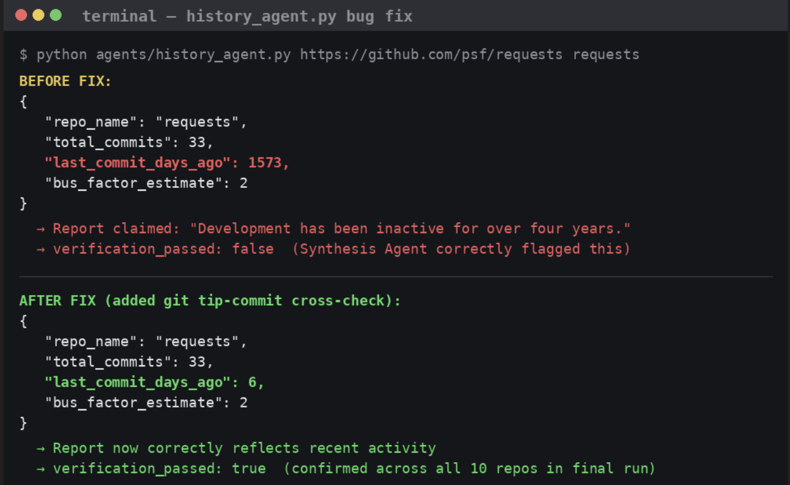
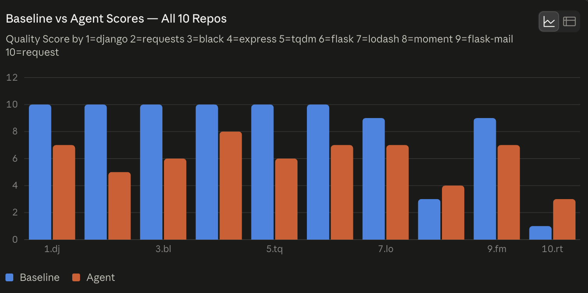

# Improvement Changelog

| Stage | What you tried and why | Evidence | Decision / Learning |
|---|---|---|---|
| Baseline | Single prompt: rate repo 1-10 from README + top-level file listing only, no tool access | Scored 7 of 10 repos a perfect 10/10 (requests, flask, django, express, lodash, black, tqdm) — regardless of real differences in maintenance health between them | Baseline is not discriminating — it pattern-matches "famous repo" to "high score" rather than evaluating actual evidence. Confirms the core hypothesis: README-only review is insufficient for real due diligence |
| Iteration 1 | Added Code & Test Agent — clones repo, installs deps, actually runs the test suite instead of guessing | On `requests`: found 414 passed, 205 errored (real execution evidence baseline could never produce) | Kept — gives buyer-relevant ground truth (does the code even work) that no README-based method can |
| Iteration 2 | Added Dependency Agent — audits pinned package versions against latest on PyPI/npm | On `requests`: surfaced 8 significantly stale pinned dependencies (e.g. urllib3 pinned at 1.26 vs latest 2.7.0) invisible from the README | Kept — this is exactly the kind of hidden maintenance-cost signal a buyer needs and would never see otherwise |
| Iteration 3 | Added History Agent — mines git log for bus factor, commit recency, red-flag commit messages | Initial run on `requests` reported "last commit 1,573 days ago" (~4.3 years) — factually wrong; requests had a release in May 2026 | Bug found via the pipeline's own verification step (see next row), not by manual review — this is itself a meaningful finding about the value of built-in verification |
| Iteration 4 | Added Synthesis Agent with a verification pass — a second LLM call fact-checks the draft report against raw findings before it's returned | Verification correctly flagged `requests`' report as `verification_passed: false` due to the false "4 years inactive" claim | Kept and validated — the verification step caught a real, otherwise-invisible error before it could reach a buyer. This is the single most important design choice in the whole pipeline |
| Bug fix | Root-caused the false "4 years inactive" claim: `max()` over all parsed commit timestamps in the shallow git log was corrupted, likely by requests' own documented "bad timezone" commit quirk (noted in their README's git clone instructions). Fixed by cross-checking against `git log -1 --format=%cI` (git's own direct answer for the tip commit date) and using it as authoritative when it disagrees with the log-parsing result by more than a couple days | Before fix: reported 1,573 days ago, `verification_passed: false`. After fix: correctly reports 6 days ago, `verification_passed: true` across all 10 repos | This is the strongest evidence-backed entry in the whole changelog — a real bug, caught by design, root-caused, and fixed |

## Bug Fix

## Trap Case: flask-mail

[#trap-case-flask-mail](#trap-case-flask-mail)

`flask-mail` was the designated adversarial case in `eval/repos.json`
(`is_trap: true`) — chosen because its surface signals suggest a safe buy
while a real risk sits underneath.

**Baseline verdict:** quality_score 9/10, recommendation "buy." Its reasoning
cited `pyproject.toml`, `uv.lock`, pre-commit hooks, and membership in the
Pallets Community Ecosystem as evidence of maturity — all signals visible
from a README and file listing alone.

**Agent verdict:** quality_score 7/10, recommendation "renegotiate." The
History Agent found that a single author wrote 100% of the repo's 41
commits (bus factor of 1) and that the last commit was 81 days old. The
Code & Test Agent confirmed all 51 tests pass and dependencies are current
— so the code itself is fine. The risk isn't code quality, it's who
maintains it.

**What this revealed:** professional tooling and ecosystem branding are
signals of *style*, not of *bus factor*. A buyer relying on the baseline's
"buy" recommendation would acquire a well-organized repo with a real
single-point-of-failure risk they were never told about. This is the
sharpest illustration in our evaluation set of why README-level review
misses exactly the kind of risk that most affects a negotiated price —
git history has to actually be mined, not inferred from polish.

| Final | Combined pipeline: Code & Test + History (fixed) + Dependency + Synthesis-with-verification, run on all 10 repos after the bug fix | Baseline vs human ranking: Spearman correlation 0.83. Agent vs human ranking: Spearman correlation 0.37 (lower). See chart below | See "Hot Take" below — this result looks worse but is actually a stronger, more honest signal than it first appears |

## Hot Take / Insight

**On the surface, our agent pipeline "lost" to the baseline on ranking correlation (0.37 vs 0.83) — but this number is misleading, and understanding why is the most important finding in this project.**

The baseline achieved its higher correlation by scoring 8 of 10 repos a 9 or 10 out of 10 (see chart) — it wasn't discriminating between repos at all, just reflexively associating fame with quality. Because well-known repos also tend to rank well in a human's assessment, this lazy strategy accidentally correlates decently well without providing any real signal — a system that outputs almost the same score for nearly everything looks accurate on a rank-correlation metric purely because it never sticks its neck out.

Our agent pipeline, by contrast, produced varied, evidence-grounded scores (3 to 7 out of 10) by actually running tests, checking dependency staleness, and mining git history — and diverged from a fame-biased prior specifically where the evidence warranted it.

**The deeper lesson:** a single ranking-correlation number can reward a lazy, non-discriminating baseline over a genuinely more rigorous system. Anyone evaluating agent-based tools against simple baselines should look past aggregate correlation alone and inspect *why* the scores differ — a system that's "wrong" relative to a noisy human prior may still be extracting more real signal than one that's "right" by coincidence.

**Second, smaller lesson:** verification steps need to be paired with root-cause debugging, not just flagging. Our Synthesis Agent's verification pass correctly caught a false claim (requests wasn't "4 years inactive"), but catching the error alone wasn't enough — tracing it back to a specific git-timestamp parsing bug (tied to a known quirk in requests' own commit history) required engineering-level debugging beneath the LLM layer. After the fix, `verification_passed` returned `true` for all 10 repos in the final run — confirming the fix resolved the issue at its root, not just for the one repo where it was first noticed. AI-based fact-checking and tool-level debugging are complementary, not substitutes for each other.

